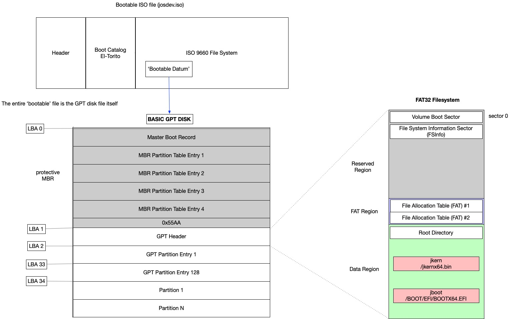
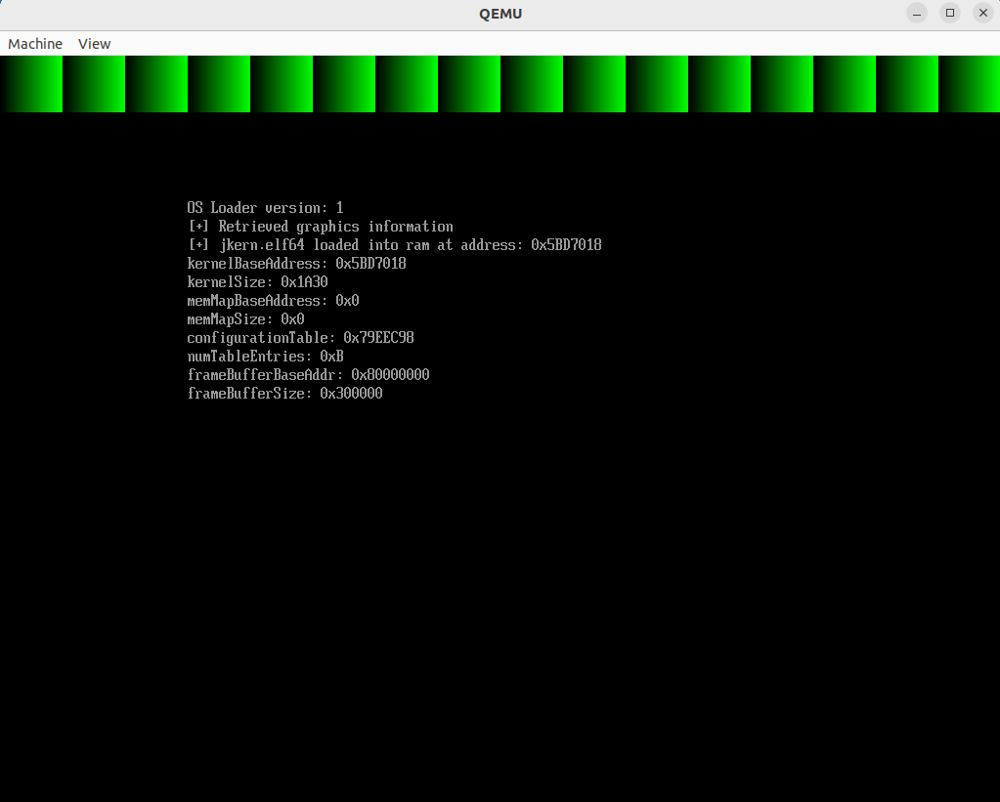

# About
I have been in the Cybersecurity industry for over a decade and wanted to use this platform as a way to showcase some of my personal Cybersecurity projects while creating opportunities for collaboration via the Github and open-source Cybersecurity community. My goal is to utilize the GitHub platform in a way that will allow me to turn my ideas into tangible projects, allowing me to learn the newest technologies while staying relevant in this rapidly changing field.

## Project - Operating System Bootloader and x86 kernel, May 2023 - Present
This project creates a minimal operating system loader utilizing the UEFI Development Kit (EDK2) that loads
a file from a storage location into memory and passes control to it. This file happens to be my own x86
operating system kernel that is in the very early stages of development.

Project Page - [https://github.com/hasselj/josdev-pub](https://github.com/hasselj/josdev-pub)

#### Overview of the filesystem as it relates to our bootable ISO file.


#### The green lines represent when the kernel is given control of the CPU.



## Post - Analyzing the SigmaHQ open source rule set, April 2023
Sigma is a collection of open source vendor neutral cyber detection rules designed to help find potentially nefarious activity occurring on networks and host systems. Rules exist in several categories to include application, cloud, Linux, network, web, etc. Each rule has two main components, the metadata and the detection rule. While the rule is used to detect activity based on strings/boolean logic, etc., the metadata is information about the rule itself such as who wrote it, contact information, and a status indicating the maturity level of the rule. Currently, the possible values for Status are stable | test | experimental | deprecated | unsupported.

Rules marked as stable have been in the community for a certain amount and have, in theory, been through some level of scrutiny or testing. I thought it would be interesting to analyze a recent stable release of the Generic Detection Rule Set and see how many rules exist in each category and how many are marked as stable.

Using the data in the 2024-03-26 release,
https://github.com/SigmaHQ/sigma/releases/tag/r2024-03-26

Sample code used to process each rule 'yml file' and report the results:
```python
import glob
import yaml
import sys
import os

# from https://github.com/SigmaHQ/sigma/releases/tag/r2024-03-26

RULE_ROOT_DIR = '/tmp/rules'
RULES = ['application', 'category', 'cloud', 'compliance', 'linux', 'macos', 'network', 'web', 'windows']

def analyze_rules(yml_file_list):
    rule_statuses = {}
    rules_processed = 0

    for f in yml_file_list:
        with open(f, 'r') as stream:
            try:
                obj = yaml.safe_load(stream)
            except yaml.YAMLError as exc:
                print(exc)
                sys.exit(1)
            rules_processed += 1
            status_value = obj['status']
            if status_value not in rule_statuses:
                rule_statuses[status_value] = 1
            else:
                rule_statuses[status_value] += 1
    return (rules_processed, rule_statuses)


def main():
    for rule_type in RULES:
        rule_dir_path = os.path.join(RULE_ROOT_DIR, rule_type)
        yml_files = glob.glob(f'{rule_dir_path}/**/*.yml', recursive=True)

        if len(yml_files) == 0:
            print('[DEBUG] globbing failed?')
            sys.exit(1)
        rules_processed, rule_status_dict = analyze_rules(yml_files)

        print('Rule category:', rule_type)
        print('count of rules processed:', rules_processed)
        print(rule_status_dict)
        percentage = 0
        if 'stable' in rule_status_dict:
            percentage = (rule_status_dict['stable'] / rules_processed) * 100
        else:

            percentage = 0
        print('Total percentage of rules marked stable:', int(percentage), '%')
        print(' ')

if __name__ == '__main__':
    main()
```

Results:
```bash
$ python sigma-sandbox/foobar.py

Rule category: application
count of rules processed: 52
{'stable': 4, 'test': 26, 'experimental': 22}
Total percentage of rules marked stable: 7 %

Rule category: category
count of rules processed: 7
{'test': 4, 'stable': 3}
Total percentage of rules marked stable: 42 %

Rule category: cloud
count of rules processed: 219
{'test': 160, 'experimental': 57, 'stable': 2}
Total percentage of rules marked stable: 0 %

Rule category: compliance
count of rules processed: 1
{'stable': 1}
Total percentage of rules marked stable: 100 %

Rule category: linux
count of rules processed: 130
{'stable': 5, 'test': 102, 'experimental': 23}
Total percentage of rules marked stable: 3 %

Rule category: macos
count of rules processed: 37
{'test': 28, 'experimental': 9}
Total percentage of rules marked stable: 0 %

Rule category: network
count of rules processed: 34
{'test': 31, 'stable': 3}
Total percentage of rules marked stable: 8 %

Rule category: web
count of rules processed: 41
{'test': 37, 'experimental': 4}
Total percentage of rules marked stable: 0 %

Rule category: windows
count of rules processed: 2070
{'test': 1543, 'experimental': 482, 'stable': 45}
Total percentage of rules marked stable: 2 %
```

The category with the most rules is Windows with 2070 and only 2% are marked as stable.
Hopefully as the community adds new rules and refines existing ones, the stable rule
percentages will increase over time.

References:\
https://github.com/SigmaHQ/sigma/ \
https://sigmahq.io/docs/basics/rules.html#metadata-status
